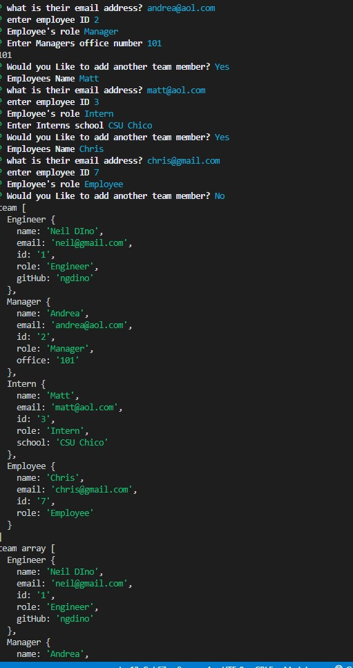
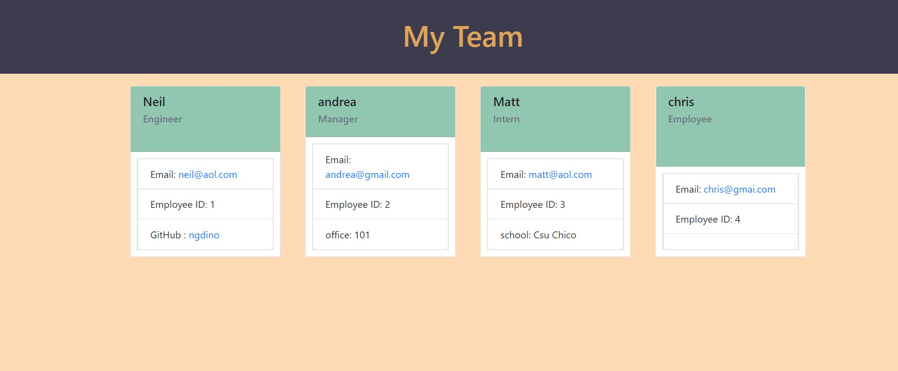

# Team Profile Generator

  ## Description
  This project for UC Berkeley Extension's Full Stack Web Development course is a team membe generator.  I used Node along with jest, the inquirer, and FS packages. 

  I first needed to create the constructors for each class of workers. Those files are in the lib folder.  I then used TDD runing tests on jest to make sure my constructors were working properly using the data that would come from my inquierer form.

  When node index is typed into the console it will take you through a series of questions.  Once completed that data will be used to write an HTML file into the dist folder that will have cards for each team member.  It will also copy a CSS file into the dist folder.  The HTML file will display the team members with the proper information and have working links for their emails and github if applicable.

  

  ## Image
  Here is an example of the Inquirer prompt and the resulting data

  

  Here is an example of the generated HTML file:

  

  ## Video

  Link to my video explaining project:

  https://youtu.be/jxoRY0ruYzs

  ## Questions

  [Github](https://github.com/a)
  
  Email me: n.dino90@gmail.com